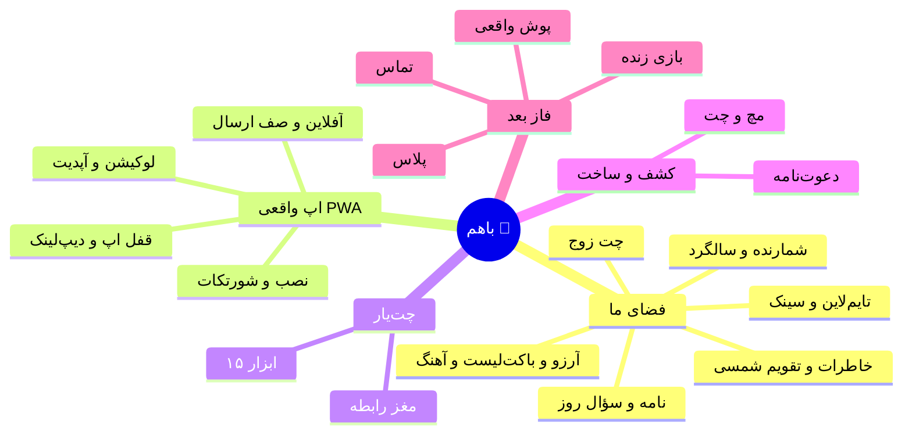

# 🗺 مسیر توسعه باهم — از وب‌اپ تا «اپ واقعی»

> نقشه ذهنی تصویری: [`docs/mindmap.svg`](docs/mindmap.svg)

---

## ۱. آنالیز وضعیت فعلی (نسخه ۸٫۰)

### ✅ چی داریم؟

| حوزه | وضعیت | توضیح |
|---|---|---|
| 💑 فضای ما (۱۲ بخش) | ✅ کامل | شمارنده، چت زوج، خاطرات، تقویم شمسی، یادداشت، آرزو، باکت‌لیست، نامه مُهرشده، سؤال روز، تایم‌لاین، آهنگ، سینک |
| 🧠 چت‌یار | ✅ کامل | ۱۵ ابزار فارسی + مغز رابطه + استریم + شبیه‌ساز کرش |
| 🔥 کشف و مچ | ✅ کامل | کشف نزدیک‌ها، لایک/مچ، چت دونفره، دوز زنده، گردونه، استوری یک‌خطی |
| 💌 براش بساز | ✅ کامل | دعوت‌نامه شخصی چندمناسبت با چت دوطرفه و پنل سازنده |
| 🌙 تب «ما» | ✅ کامل | چرخه/PMS، زبان عشق، مغز رابطه، حل اختلاف دونفره، مدرسه رابطه |
| 🔗 جفت‌شدن زوج | ✅ کامل | لینک دعوت ۷روزه، اشتراک granular، قطع ارتباط با پاک‌سازی کامل |
| 📲 PWA پایه | ⚠️ ناقص | نصب‌شدنی + آفلاین پایه هست؛ ولی شورتکات، صف آفلاین، قفل اپ و دیپ‌لینک نداره |
| ☁️ بک‌اند | ✅ کامل | Cloudflare Pages Functions + KV، احراز هویت توکنی، ریت‌لیمیت، پنل ادمین |

### ❌ چی کم داریم؟ (گپ نسبت به Between + یه اپ واقعی)

**الف) قابلیت‌های زوج (از لیست Between):**
1. 📍 اشتراک‌گذاری لوکیشن (لحظه‌ای + زنده موقت) — *نداریم*
2. 📞 تماس صوتی/تصویری رایگان — *نداریم*
3. 🎮 بازی زنده دونفره سینک‌شده (کی منو بهتر می‌شناسه؟) — *نصفش داریم (تکی + دوز مچ)*
4. 💸 هزینه‌های مشترک (دانگ!) — *نداریم*
5. 😊 حال مشترک روزانه — *نصفش داریم (تکی + استاتوس)*
6. 💎 پلاس/نسخه پولی — *نداریم*
7. 📖 کتاب خاطرات (خروجی چاپی/PDF) — *نداریم*
8. 🧸 شخصی‌سازی عمیق (لقب، والپیپر چت، آیکون) — *نصفش داریم*

**ب) «اپ واقعی» بودن (PWA کامل):**
1. شورتکات‌های نصب (لانگ‌پرس روی آیکون) — *نداریم*
2. دیپ‌لینک (`?tab=&view=`) — *نداریم (فقط `?pair=`)*
3. صف ارسال آفلاین (outbox) + بنر آفلاین — *نداریم*
4. اعلان آپدیت نسخه — *نداریم (سایلنت آپدیت می‌شه)*
5. قفل سراسری اپ (PIN + قفل خودکار) — *نداریم (فقط تب «ما» قفل داره)*
6. دریافت اشتراک از اپ‌های دیگه (Share Target) — *نداریم*
7. پوش واقعی (VAPID) — *نداریم (فقط نوتیف لوکال)*
8. اسپلش iOS و اسکرین‌شات مانیفست — *نداریم*

---

## ۲. نقشه ذهنی (متنی)

---

## ۳. مسیر توسعه (فازبندی)

### 🟢 فاز ۱ — نسخه ۸٫۱ «اپ واقعی» (همین نسخه، در حال ساخت)
> هدف: حس و رفتار دقیقاً مثل یه اپ نصبی.

- [x] شورتکات‌های مانیفست (فضای ما / چت ما / خاطره جدید) + `id` و `categories`
- [x] دیپ‌لینک کامل: `?tab=space&view=chat` و `&new=1` برای باز کردن مستقیم کامپوزر
- [x] دریافت اشتراک از اپ‌های دیگه (Share Target) → باز کردن خاطره با متن آماده
- [x] بنر آفلاین + صف ارسال آفلاین برای چت زوج (ارسال خودکار بعد از وصل شدن)
- [x] اعلان «نسخه جدید» با دکمه به‌روزرسانی
- [x] قفل سراسری اپ: PIN + قفل خودکار بعد از ۲ دقیقه پس‌زمینه + دکمه قفل
- [x] لقب‌های دو نفره + والپیپر چت زوج (۵ طرح)
- [x] اشتراک لوکیشن در چت زوج: 📍 لحظه‌ای + 🔴 زنده (۱۵ دقیقه / ۱ ساعت) با انقضای خودکار
- [x] به‌روزرسانی سرویس‌ورکر (v8) + کش هوشمندتر

### 🟢 فاز ۲ — نسخه ۸٫۲ «باهم» ✅ (انجام شد)
> هدف: تعامل لحظه‌ای بیشتر + اسم تازه.

- [x] **اسم تازه: «باهم»** 💞 — «از مخ زدن تا ما شدن» (مانیفست، تایتل، SW، فوترها)
- [x] پوش واقعی (Web Push + VAPID خودکار): tickle پیام چت + تاگل در تنظیمات
- [x] بازی دونفره سینک‌شده: «کی منو بهتر می‌شناسه؟» (سازنده + بازی + نتایج، union جواب‌ها)
- [x] حال مشترک روزانه (چک‌این دوطرفه + استریک + نمای هفته)
- [x] دانگ و هزینه مشترک (ثبت خرج + مانده ۵۰/۵۰ + تسویه)
- [x] کتاب خاطرات: خروجی چاپی/PDF از خاطرات، روزهای خاص و آرزوها
- [x] دستیار حافظه AI: «از خاطرات بپرس» با حالت memory (فقط از زمینه‌ی خودت)

### 🟢 فاز ۱۳ — نسخه ۱۰ «جشن ده» ✅ (انجام شد)
> هدف: نقطه‌ی عطف — منشور، مرور سال و افتخارها.

- [x] قانون‌های ما (منشور + امضای دوطرفه + جشن تصویب)
- [x] سال ما (مرور خودکار + پاتوق + کپی خلاصه)
- [x] تالار افتخار (مدال‌ها + پیشرفت قفل‌ها + رکوردها)

### 🟢 فاز ۱۲ — نسخه ۹٫۹ «قاب و شمارش» ✅ (انجام شد)
> هدف: رقابت بامزه‌ی هفتگی + آرزوی ماهانه‌ی واقعی + همه‌ی قرارها جلو چشم.

- [x] چالش عکس هفته (سوژه‌ی خودکار + رأی + تاج + یادآور)
- [x] صندوق آرزوهای ماه (پیشنهاد + رأی + برآورده + یادآور)
- [x] شمارش‌های ما (چندتایی + اموجی + مرتب)

### 🟢 فاز ۱۱ — نسخه ۹٫۸ «شام و فیلم» ✅ (انجام شد)
> هدف: شب‌های مشترک بهتر + شکم سیر + خواب‌های بامزه.

- [x] فیلم‌بین ما (رأی دوطرفه + ستاره + یادآور)
- [x] آشپزخونه‌ی ما (دستور + تایمر + شمارش پخت)
- [x] رویای مشترک (دفترچه + تعبیر ثابت)

### 🟢 فاز ۱۰ — نسخه ۹٫۷ «پین و پادکست» ✅ (انجام شد)
> هدف: جاهای خاص روی نقشه + صدای همدیگه همیشه + آرزوهای مشترک.

- [x] نقشه‌ی خاطرات (نقشه‌ی واقعی + پین + جستجوی جا)
- [x] پادکست ما (ضبط ۶۰ ثانیه‌ای + پخش همه)
- [x] قلک آرزو (هدف + واریز + جشن رسیدن)

### 🟢 فاز ۹ — نسخه ۹٫۶ «خط و پیکسل» ✅ (انجام شد)
> هدف: خلق مشترک روزانه + عادت‌سازی زوجی + بازی با پیکسل.

- [x] داستان زنجیره‌ای نوبتی (ادغام خط‌ها + یادآور نوبت)
- [x] چالش ۳۰ روزه (۳۰ ماموریت + پیشرفت + تقویم + یادآور)
- [x] پیکسل‌آرت روزانه (بوم ۱۶×۱۶ + گالری زوجی)

### 🟢 فاز ۸ — نسخه ۹٫۵ «شانس و زمان» ✅ (انجام شد)
> هدف: پایان دعوای «کجا بریم؟» + حرفی برای آینده + قرار متناسب با هوا.

- [x] گردونه‌ی تصمیم مشترک (۳ دسته + دستی + تاریخچه‌ی سینک‌شده)
- [x] کپسول زمان (دفن/بازگشایی + شمارش معکوس + یادآور)
- [x] هوای قرار (API رایگان + پیشنهاد هوشمند + کش آفلاین)

### 🟢 فاز ۷ — نسخه ۹٫۴ «سفر و جشن» ✅ (انجام شد)
> هدف: ماجراجویی مشترک + هیچ سالگردی یاد نره + قرار همیشه جلو چشم.

- [x] سفر مشترک سینک‌شده (تریپ + چک‌لیست چمدون دوطرفه + پیشنهاد آماده)
- [x] سالگرد هوشمند (کارت معکوس + ایده‌ی سورپرایز + یادآور)
- [x] بج شمارش معکوس روی آیکون اپ

### 🟢 فاز ۶ — نسخه ۹٫۳ «مدال و ماه» ✅ (انجام شد)
> هدف: انگیزه‌ی جمعی + قرارهای بی‌نقص + فضای شخصی‌تر + پایان قشنگ روز.

- [x] امتیاز زوج + ۱۲ مدال + ۵ سطح با جشن مدال تازه
- [x] تقویم پیشرفته (یادآوری ۴ مرحله‌ای + گوگل کلندر + ICS)
- [x] تم‌ساز سفارشی سینک‌شده (دو رنگ دلخواه)
- [x] حالت شب (نوار خلاصه‌ی امروز + نادج شب‌بخیر)

### 🟢 فاز ۵ — نسخه ۹٫۲ «دورهمی» ✅ (انجام شد)
> هدف: تصمیم‌گیری مشترک + پیدا کردن همه‌چیز + زنده نگه داشتن گذشته.

- [x] نظرسنجی دو نفره سینک‌شده (رأی زنده + بستن)
- [x] جستجوی سراسری Ctrl+K روی ۱۰ بخش
- [x] حالت مناسبتی خودکار (۵ مناسبت + جشن)
- [x] ایمپورت تاریخچه تلگرام/واتساپ به خاطرات

### 🟢 فاز ۴ — نسخه ۹٫۱ «جشن و آمار» ✅ (انجام شد)
> هدف: سرگرمی مشترک بیشتر + خروجی‌های قابل اشتراک.

- [x] چالش‌های زوج سینک‌شده (۲۴ ایده + دستی + استریک دوطرفه)
- [x] بازی «این یا اون» دوطرفه با رو شدن جواب‌ها
- [x] نامه صوتی (ویس تا ۹۰ ثانیه، حتی مهرشده)
- [x] اشتراک عمومی خاطره/کارت ما (لینک ۹۰ روزه + صفحه /share)
- [x] آمار رابطه + کارت گزارش ماه (PNG)
- [x] یادآور قرار (تیکل خودکار رویداد نزدیک) + نادج چالش

### 🟢 فاز ۳ — نسخه ۹٫۰ «تماس و پلاس» ✅ (انجام شد)
> هدف: برابری کامل با Between + درآمد.

- [x] تماس صوتی/تصویری WebRTC با سیگنالینگ روی همین بک‌اند (P2P + STUN + بنر ورودی)
- [x] باهم پلاس: کد فعال‌سازی + درگاه زرین‌پال (ماهانه/سالانه/سندباکس) + پنل ادمین + قفل‌ها
- [x] ویدیو/ویس در چت زوج + استیکرهای اختصاصی (۲ پک)
- [x] حالت «فقط خواندنی» بعد از قطع ارتباط + بکاپ خودکار پیش از قطع (هر دو طرف)

---

## ۴. اصول معماری (ثابت می‌مونه)

1. **Local-first**: همه‌چیز آفلاین کار کنه؛ سرور فقط سینک.
2. **حریم خصوصی granular**: هر بخش جداگانه قابل خصوصی‌سازی.
3. **بدون شماره/ایمیل**: فقط یوزرنیم؛ داده سلامت هرگز به سرور نمی‌ره.
4. **PWA خالص**: بدون بیلد جدا؛ یه کدبیس، همه‌جا نصب می‌شه.
